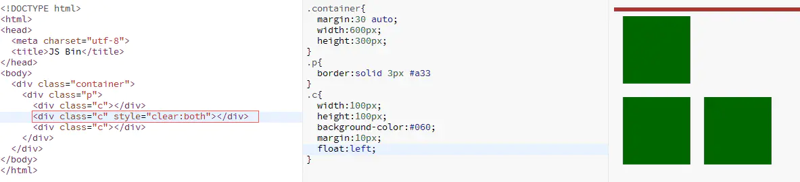
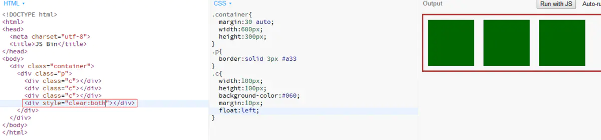
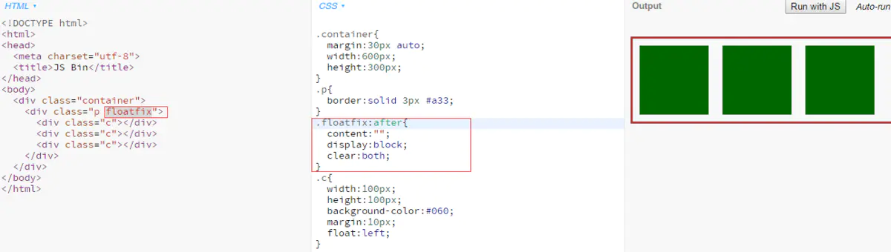
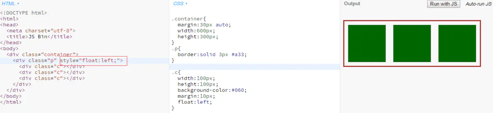

# CSS清除浮动（Clear与BFC）

## 利用clear属性，清除浮动

第二个div添加了clear:both属性后，其左侧的div(第一个div)不再浮动，所以后面的div都换行了。

### 添加空div清理浮动

我们可以利用这点在父容器的最后添加一个空的div，设置属性clear:left或clear:both，这样就可以达到撑开父元素的目的了。

### 使用css插入元素

上面的做法浏览器兼容性不错，但是向页面添加了空的内容来达到改变效果的目的，代码不简洁。我们可以利用css的：after伪元素来做此事。

对父容器添加floatfix类后，会为其追加一个不可见的块元素，然后设置其clear属性为left或both。

- 对于IE6、7不支持伪元素，可以使借助BFC/hasLayout

## 使父容器形成BFC（Block Format Content）

1、BFC有三个特性：

（1）BFC会阻止垂直外边距（margin-top、margin-bottom）折叠

按照BFC的定义，只有同属于一个BFC时，两个元素才有可能发生垂直 margin的重叠，这个包括相邻元素，嵌套元素，只要他们之间没有阻挡（例如边框，非空内容，padding等）就会发生margin重叠。

因此要解决margin重叠问题，只要让它们不在同一个BFC就可以了。

（2）BFC不会重叠浮动元素

（3）BFC可以包含浮动

我们可以利用BFC的第三条特性来“清浮动”，这里其实说清浮动已经不再合适，应该说包含浮动。也就是说只要父容器形成BFC就可以包含浮动，从而被撑开，简单看看如何形成BFC：

（1）float值不为none，可以是left，right或both

（2）overflow为hidden或auto或scroll

（3）display为inline-block或table-cell或table-caption

（4）position为absolute或fixed

2、我们可以对父容器添加这些属性使其变成BFC，从而达到“清浮动”效果

2.1利用float来使父容器形成BFC

我们可以看到父容器高度没有塌陷，但是长度变短了，因为div应用float后会根据内容来改变长度（absolute，float宽度都会自动收缩）。

2.2使用BFC的其它局限

上面提到使用float形成BFC的时候会使父容器的长度缩短，而且还有个重要的缺陷——父容器float解决了其塌陷问题，那么父容器的父容器怎么办？难道要全部使用float吗？BFC的几种方式都有各自的问题，

overflow属性会影响滚动条和绝对定位的元素；

position会改变元素的定位方式；

display这几种方式依然没有解决低版本IE问题。

看起来还是第一种方式比较好，可是低版本IE该怎么办呢？

（1）position:absolute

（2）float:left或right

（3）display:inline-block

（4）width:除"auto"外的任意值

（5）height:除"auto"外的任意值

（6）zoom:除"normal"外的任意值

（7）writing-mode:tb-rl

在IE7中使用overflow:hidden或scroll或auto也可以使hasLayout为true

## 写在最后

虽然我们得出了一种浏览器兼容的靠谱解决方案，但这并不代表我们一定得用这种方式，很多时候我们的父容器本身需要position：absolute等，形成了BFC的时候我们就可以直接利用这些属性了，大家要掌握原理，活学活用。总而言之清除浮动两种方式：

1、利用clear属性清除浮动

2、是父容器形成BFC

