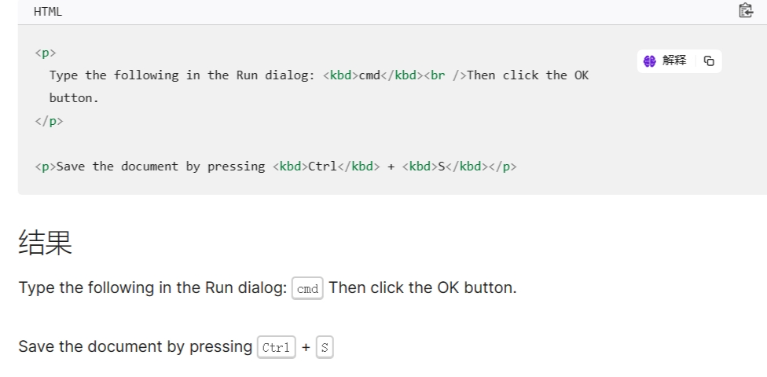

# address

包裹后的内容，文字显示为斜体，通常用于**联系信息**。

<address>
  <a href="mailto:jim@example.com">jim@example.com</a><br />
  <a href="tel:+14155550132">+1 (415) 555‑0132</a>
</address>

# article

元素表示文档、页面、应用或网站中的独立结构

应用场景：**论坛帖子、杂志或新闻文章、博客、用户提交的评论、交互式组件**等。

# aside

表示一个和其余页面内容几乎无关的部分 可以被单独的拆分出来而不会使整体受影响

应用场景：**侧边栏、广告、相关内容、辅助内容**等。

# audio

 用于**播放音频文件**，可以添加`controls`属性来显示播放控制按钮。

<audio controls>
  <source src="https://www.w3schools.com/html/horse.mp3" type="audio/mpeg">
  <source src="https://www.w3schools.com/html/horse.ogg" type="audio/ogg">
  Your browser does not support the audio element.
</audio>

# canvas

画布，用于绘制图形、动画、游戏等。

# caption

**展示表格的标题**,使用`caption-side: top|bottom|left|right`来设置标题的位置;

# code

表示计算机代码，通常会有语法高亮。
<code>123</code>

# datalist

用于定义选项列表，可以与`input`元素配合使用，实现自动完成。

<div>
  <label for="ice-cream-choice">Choose a flavor:</label>
  <input list="ice-cream-flavors" id="ice-cream-choice" name="ice-cream-choice" />
  <datalist id="ice-cream-flavors">
    <option value="Chocolate"></option>
    <option value="Coconut"></option>
    <option value="Mint"></option>
    <option value="Strawberry"></option>
    <option value="Vanilla"></option>
  </datalist>
</div>

<style module>
#ice-cream-choice{
    border-radius: 8px;
    padding-left: 10px;
    box-sizing: border-box;
}
</style>

# fieldset

用于将相关表单元素分组，可以添加`disabled`属性来禁用整个组。

# footer

表示页面的底部区域，通常包含版权信息、联系方式、网站地图等。

# header

表示页面的头部区域，通常包含导航、logo、搜索框等。

# iframe

用于嵌入另一个页面，可以添加`sandbox`属性来限制嵌入的功能。

# kbd

用于表示键盘按键，通常会有颜色变化。



# main

表示主要内容区域，通常包含页面的主要内容。

# mark

用于突出显示文本，通常会有背景颜色。

```html
<p>&lt;mark&gt; 元素用于 <mark>高亮</mark> 文本</p>
```

<p>&lt;mark&gt; 元素用于 <mark>高亮</mark> 文本</p>

# menu

HTML 规范中被描述为 `<ul> `的语义替代，但浏览器将其视为与 `<ul> `没有区别（并通过无障碍树暴露）

# nav

表示导航区域，导航部分的常见示例是菜单，目录和索引。

# picture

通过包含零或多个` <source>` 元素和一个 ``元素来为不同的显示/设备场景提供图像版本。浏览器会选择最匹配的子 `<source>` 元素，如果没有匹配的，就选择 `` 元素的 src 属性中的 URL。然后，所选图像呈现在``元素占据的空间中。

```html
<picture>
  <source srcset="/media/cc0-images/surfer-240-200.jpg" media="(orientation: portrait)" />
  
</picture>
```
# pre

 用于表示预格式化文本， 会保留空格和换行符。

```html
<pre>
  <code>
    function myFunction() {
      console.log("Hello, world!");
    }
  </code>
</pre>
```
# section

表示文档中的一个区域，通常包含一个标题和一些相关内容。

# small

表示小号文本，通常会有更细的字体。

# sub

用于表示下标。

# supsup

用于表示上标。

# template

表示一个模板，可以包含 HTML 代码，但不会在浏览器中呈现。可以使用JavaScript 动态地将模板内容插入文档。

```html
<table id="producttable">
  <thead>
    <tr>
      <td>UPC_Code</td>
      <td>Product_Name</td>
    </tr>
  </thead>
  <tbody>
    <!-- 现有数据可以可选地包括在这里 -->
  </tbody>
</table>

<template id="productrow">
  <tr>
    <td class="record"></td>
    <td></td>
  </tr>
</template>

<script>
// 通过检查来测试浏览器是否支持 HTML 模板元素
// 用于保存模板元素的内容属性。
if ("content" in document.createElement("template")) {
  // 使用现有的 HTML tbody 实例化表和该行与模板
  let t = document.querySelector("#productrow"),
    td = t.content.querySelectorAll("td");
  td[0].textContent = "1235646565";
  td[1].textContent = "Stuff";

  // 克隆新行并将其插入表中
  let tb = document.getElementsByTagName("tbody");
  let clone = document.importNode(t.content, true);
  tb[0].appendChild(clone);

  // 创建一个新行
  td[0].textContent = "0384928528";
  td[1].textContent = "Acme Kidney Beans";

  // 克隆新行并将其插入表中
  let clone2 = document.importNode(t.content, true);
  tb[0].appendChild(clone2);
} else {
  // 找到另一种方法来添加行到表，因为不支持 HTML 模板元素。
}

</script>
```

# time

用于表示日期和/或时间，可以添加`datetime`属性来提供日期和/或时间的具体值。

# input

 用于创建输入字段，包括文本输入、搜索输入、电话输入、日期输入、颜色输入等。

```html
<input type="text" id="name" name="name" required>
<input type="color">
<input type="date">
<input type="email">

<!-- 被选择的文件以 HTMLInputElement.files 属性返回，它是包含一系列 File 对象的 FileList 对象。 -->
<input type="file" id="avatar" name="avatar" accept="image/png, image/jpeg,.doc,.docx,application/msword,application/vnd.openxmlformats-officedocument.wordprocessingml.document" />

<input type="image">
<input type="month">
<input type="number">
<input type="password" id="pass" name="password" minlength="8" required />
<input type="radio">
<input type="range" id="volume" name="volume" min="0" max="11" />

<!-- reset 类型的 <input> 元素将渲染为按钮，且带有默认的 click 事件，用于将表单中的所有输入重置为其初始值。 -->
<input type="reset">

<input type="search">
<input type="submit">
<input type="time" id="appt" name="appt" min="09:00" max="18:00" required />
<input type="url" name="url" id="url" placeholder="https://example.com" pattern="https://.*" size="30" required />
<input type="week" name="week" id="camp-week" min="2018-W18" max="2018-W26" required />
```