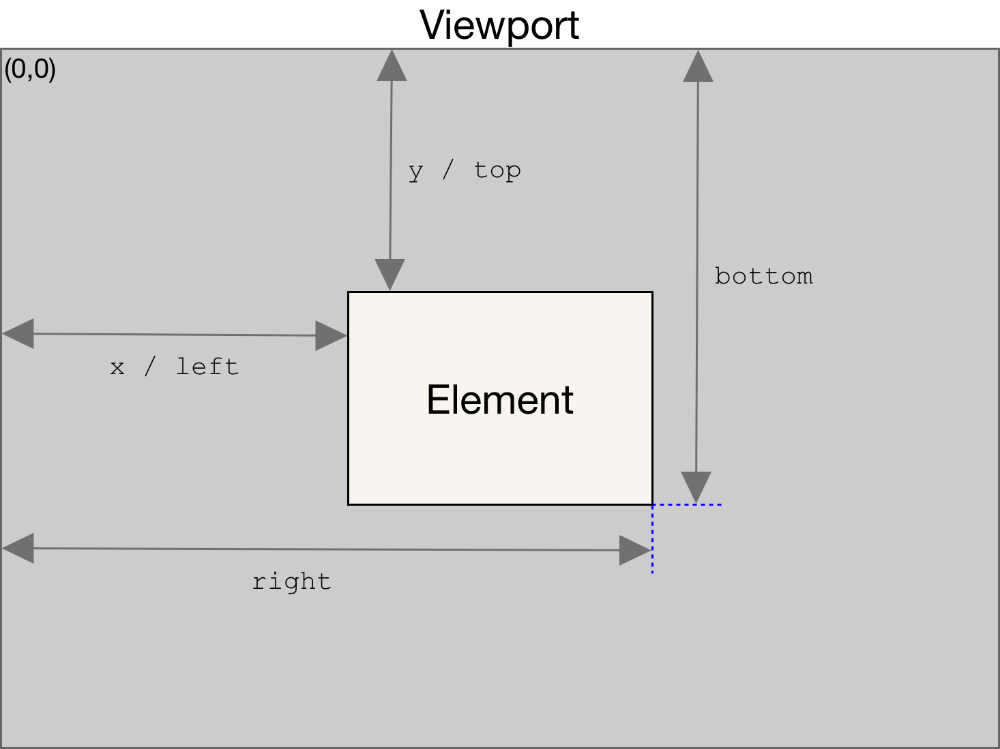

# 原理

1. 存储图片的真实路径，把图片的真实路径绑定给一个以data开头的自定义属性data-url即可，页面中的img元素，如果没有src属性，浏览器就不会发出请求去下载图片（没有请求就提高了性能）

``` html
<div class="scrollLoading" data-url="loaded.html">加载中...</div>
```

2. 初始化img的时候，src不能是真实的图片地址(会一次性发送请求)，也不可以是空地址或者坏地址(会出现出错图标，如下所示：）


3. 3.设置img的默认src为一张1px*1px，很小很小的gif透明图片（所有的img都用这一张，只会发送一次请求），之所以需要是透明的，是需要透出通过background设置的背景图(一张loading.png，就是一个转圈圈的背景效果图)
   
``` html

```

4. 需要一个滚动事件，判断元素是否在浏览器窗口，一旦进入视口才进行加载，当滚动加载的时候，就把这张透明的1px.gif图片替换为真正的url地址（也就是data-url里保存的值）
   
5. 等到图片进入视口后，利用js提取data-url的真实图片地址赋值给src属性，就会去发送请求加载图片，真正实现了按需加载

# **实现方法**

## 滚动监听+getBoundingClientRect()

### API简介

API具体介绍：(这里)[https://developer.mozilla.org/zh-CN/docs/Web/API/Element/getBoundingClientRect] 

`let oBounding=img.getBoundingClientRect()`

### 原理

oBounding此刻就等于img元素调用自己的getClientRects()方法返回的一个矩形对象，返回值是一个 DOMRect 对象，是包含整个元素的最小矩形（包括 padding 和 border-width）。该对象使用 left、top、right、bottom、x、y、width 和 height 这几个以像素为单位的只读属性描述整个矩形的位置和大小。除了 width 和 height 以外的属性是相对于视图窗口的左上角来计算的。
也就是说，当滚动位置发生了改变，top和left属性值就会随之立即发生变化（因此，它们的值是相对于视口的，而不是绝对的）。如果你需要获得相对于整个网页左上角定位的属性值，那么只要给top、left属性值加上当前的滚动位置（通过 window.scrollX 和 window.scrollY），这样就可以获取与当前的滚动位置无关的值。



### 代码

``` html
<!DOCTYPE html>
<html lang="en">

<head>
    <meta charset="UTF-8">
    <meta http-equiv="X-UA-Compatible" content="IE=edge">
    <meta name="viewport" content="width=device-width, initial-scale=1.0">
    <title>Document</title>
    <style>
        * {
            margin: 0;
            padding: 0;
        }

        img {
            width: 500px;
            height: 500px;
            display: block;
        }

        .two {
            position: absolute;
            top: 1000px;
        }
    </style>
</head>

<body>
    <div class="one"></div>
    <div class="two">
        
        
        
        
        
        
    </div>
    
    <script>
        let imgs = document.getElementsByTagName('img')
        // 1. 一上来立即执行一次
        fn()
        // 2. 监听滚动事件
        window.onscroll = lazyload(fn, 1000)
        function fn() {
            // 获取视口高度和内容的偏移量
            let offsetHeight = window.innerHeight || document.documentElement.clientHeight
            Array.from(imgs).forEach((item, index) => {
                let oBounding = item.getBoundingClientRect() //返回一个矩形对象，包含上下左右的偏移值
                console.log(index, oBounding.top, offsetHeight);
                if (0 <= oBounding.top && oBounding.top <= offsetHeight) {
                    item.setAttribute('src', item.getAttribute('data-url'))
                }
            })
        }
        // 函数节流
        function lazyload(fn, immediate) {
            let timer = null
            return function () {
                let context = this;
                if (!timer) {
                    timer = setTimeout(() => {
                        fn.apply(this)
                        timer = null
                    }, immediate)
                }
            }
        }
    </script>
</body>

</html>
```

## intersectionObserve()

### API简介

API具体介绍：(这里)[https://developer.mozilla.org/zh-CN/docs/Web/API/IntersectionObserver/IntersectionObserver] 

`var observer = new IntersectionObserver(callback[, options]);`

### 代码

``` html
<!DOCTYPE html>
<html lang="en">

<head>
    <meta charset="UTF-8">
    <meta http-equiv="X-UA-Compatible" content="IE=edge">
    <meta name="viewport" content="width=device-width, initial-scale=1.0">
    <title>Document</title>
    <style>
        * {
            margin: 0;
            padding: 0;
        }

        img {
            width: 500px;
            height: 500px;
            display: block;
        }

        .two {
            position: absolute;
            top: 1000px;
        }

        #triangle-up {
            width: 0;
            border-left: 50px solid transparent;
            border-right: 50px solid transparent;
            border-bottom: 100px solid red;
        }
    </style>
</head>

<body>
    <div id="triangle-up">

    </div>
    <div class="one"></div>
    <div class="two">
        
        
        
        
        
        
    </div>

    <script>
        // 这是第一种方案
        // let imgs = document.getElementsByTagName('img')
        // // 1. 一上来立即执行一次
        // let io = new IntersectionObserver(function (entires) {
        //     //图片进入视口时就执行回调
        //     entires.forEach(item => {
        //         // 获取目标元素
        //         let oImg = item.target
        //         // console.log(item);
        //         // 当图片进入视口的时候，就赋值图片的真实地址
        //         if (item.intersectionRatio > 0 && item.intersectionRatio <= 1) {
        //             oImg.setAttribute('src', oImg.getAttribute('data-url'))
        //             console.log(item)
        //             io.unobserve(oImg)
        //         }
        //     })
        // })
        // Array.from(imgs).forEach(element => {
        //     io.observe(element)  //给每一个图片设置监听
        // });

        // 第二种方案
        let imgs = document.getElementsByTagName('img')
        // 1. 一上来立即执行一次
        let observer = new IntersectionObserver(function (entires) {
            //图片进入视口时就执行回调
            entires.forEach(entry => {
                // 获取目标元素
                let oImg = entry.target
                // console.log(entry);
                // 当图片进入视口的时候，就赋值图片的真实地址
                if (entry.isIntersecting) {
                    oImg.setAttribute('src', oImg.getAttribute('data-url'))
                    console.log(entry)
                    observer.unobserve(oImg)
                }
            })
        })
        Array.from(imgs).forEach(element => {
            observer.observe(element)  //给每一个图片设置监听
        });
    </script>
</body>

</html>
```


