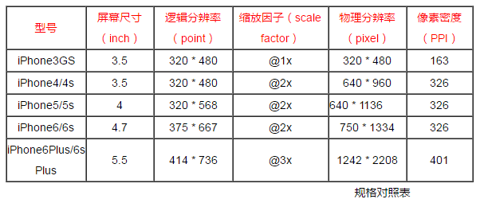

首先呢，我们将iPhone手机的相关数据表示如下：

我们要理解很多东西，比如逻辑分辨率、物理分辨率、缩放因子、ppi等，这里先不讨论。

首先呢，我们先介绍下各个屏幕宽度：

网页可见区域宽： `document.body.clientWidth`

网页可见区域高： `document.body.clientHeight`

网页可见区域宽： `document.body.offsetWidth (包括边线的宽)`

网页可见区域高： `document.body.offsetHeight (包括边线的高)`

网页正文全文宽： `document.body.scrollWidth`

网页正文全文高： `document.body.scrollHeight`

网页被卷去的高： `document.body.scrollTop`

网页被卷去的左： `document.body.scrollLeft`

网页正文部分上： `window.screenTop`

网页正文部分左： `window.screenLeft`

屏幕物理分辨率的高： `window.screen.height`

屏幕物理分辨率的宽： `window.screen.width`

屏幕可用工作区高度： `window.screen.availHeight`

屏幕可用工作区宽度： `window.screen.availWidth`

屏幕缩放因子：`window.devicePixelRatio`

屏幕逻辑分辨率：`window.screen.width * window.devicePixelRatio (缩放因子与物理分辨率的乘积)`