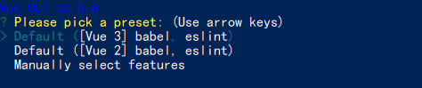
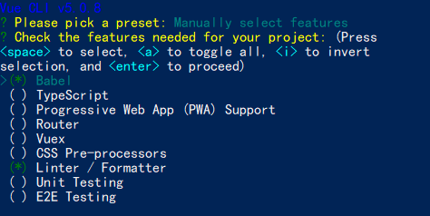

# Vue2 项目搭建

搭建 Vue2 项目有三种主要方法：

- 直接通过script加载CDN文件

- 使用官方脚手架 `Vue CLI`的 `default` 模板

- 手动选择安装依赖项和配置项

## 使用源文件

``` html
<!-- 指定某个版本的Vue.js -->
<script src="https://cdn.jsdelivr.net/npm/vue@2.7.14"></script>
<script src="https://unpkg.com/vue@2.1.5/dist/vue.min.js"></script>

<!-- 自动识别最新稳定版本的Vue.js -->
<script src="https://unpkg.com/vue@latest"></script>
<script src="https://cdn.jsdelivr.net/npm/vue/dist/vue.min.js"></script>  <!--这个很慢 -->
```

## default 模板

**使用官方脚手架（推荐）`Vue CLI`,可以快速创建一个包含所有必要配置文件和依赖项的Vue项目。**

1. 安装 `Vue CLI`：
```
npm install -g @vue/cli
```
2. 创建一个新项目：
```
vue create my-project
```
3. 进入项目目录：
```
cd my-project
```
4. 运行项目：
```
npm run dev
```

## 手动选择安装
1. 创建一个新项目：
```
vue create my-project
```
2. 选择 `Manually select features`
   



3. 选择 `Babel`、`Router`、`Vuex`、`CSS Pre-processors`、`Linter / Formatter`、`Unit Testing`、`E2E Testing`、`Axios`、`Vue-cli Plugins`、`Other`



**项目特性:**
+ `Babel`: 使用 `Babel` 将 ES6 和 ES7 代码转换为 ES5 代码，以便在旧浏览器中运行。
+ `TypeScript`: 使用 `TypeScript` 编写代码，以获得更好的类型检查和代码完成功能。
+ `Progressive Web App (PWA) Support`: 添加对 `PWA` 的支持，使您的项目可以离线安装和使用。
  

**路由:**
- `Vue Router`: 使用 `Vue Router` 管理项目的路由。
  

**状态管理:**
- `Vuex`: 使用 `Vuex` 管理状态，包括数据、状态、 mutations、actions 等。
  

**CSS 预处理器:**
- `Sass/SCSS`: 使用 `Sass/SCSS` 编写样式，并使用 `node-sass` 编译为 CSS。
- `Less`: 使用 `Less` 编写样式，并使用 `less-loader` 编译为 CSS。
- `Stylus`: 使用 `Stylus` 编写样式，并使用 `stylus-loader` 编译为 CSS。
  

**Linter/Formatter:**
- `ESLint`: 使用 `ESLint` 检查代码风格。
- `Prettier`: 使用 `Prettier` 格式化代码。

**单元测试:**
- `Jest`: 使用 `Jest` 进行单元测试。
- `Mocha` + `Chai`: 使用 `Mocha` + `Chai` 进行单元测试。

**E2E 测试:**
- `Cypress`: 使用 `Cypress` 进行端到端测试。
- `Puppeteer`: 使用 `Puppeteer` 进行端到端测试。