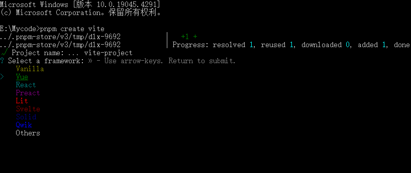

# Vue3 安装步骤

搭建 `Vue3` 项目有三种主要方法：

主要方法：

- 使用官方脚手架 `Vue CLI`的 `default` 模板。
- 基于`npm create vue`创建项目。
- 使用`vite`创建项目。


## 使用Vue CLI

[与搭建 Vue2 项目的步骤基本相同，只是 Vue3 脚手架的默认模板有所不同](/frontend/vue2/index)

## npm create vue创建项目

`Vite` 是下一代前端构建工具，它能显著提升开发体验，其核心理念是“速度优先”。

具体操作如下（点击查看[官方文档](https://cn.vuejs.org/guide/quick-start.html#creating-a-vue-application)）：

```bash
## 1.创建命令
npm create vue@latest

## 2.具体配置
## 配置项目名称
√ Project name: vue3_test
## 是否添加TypeScript支持
√ Add TypeScript?  Yes
## 是否添加JSX支持
√ Add JSX Support?  No
## 是否添加路由环境
√ Add Vue Router for Single Page Application development?  No
## 是否添加pinia环境
√ Add Pinia for state management?  No
## 是否添加单元测试
√ Add Vitest for Unit Testing?  No
## 是否添加端到端测试方案
√ Add an End-to-End Testing Solution? » No
## 是否添加ESLint语法检查
√ Add ESLint for code quality?  Yes
## 是否添加Prettiert代码格式化
√ Add Prettier for code formatting?  No
```

## 使用vite创建项目

`Vite` 是下一代前端构建工具，它能显著提升开发体验，其核心理念是“速度优先”。.

```bash
pnpm create vite
```
选择`vue`项目



# Vue3相对于Vue2的一些变化

 1. 【性能的提升】

- 打包大小减少`41%`。

- 初次渲染快`55%`, 更新渲染快`133%`。

- 内存减少`54%`。

  
 2. 【 源码的升级】

- 使用`Proxy`代替`defineProperty`实现响应式。

- 重写虚拟`DOM`的实现和`Tree-Shaking`。

  
 3. 【拥抱TypeScript】

- `Vue3`可以更好的支持`TypeScript`。

  
 4. 【新的特性】

     1. `Composition API`（组合`API`）：
        - `setup`
        - `ref`与`reactive`
        - `computed`与`watch`
        
          ......
        
     2. 新的内置组件：
        - `Fragment`
        - `Teleport`
        - `Suspense`

          ......

     3. 其他改变：
        - 新的生命周期钩子
        - `data` 选项应始终被声明为一个函数
        - 移除`keyCode`支持作为` v-on` 的修饰符
  
 生命周期整体分为四个阶段，分别是：**创建、挂载、更新、销毁**，每个阶段都有两个钩子，一前一后。

* `Vue2`的生命周期

> 创建阶段：`beforeCreate`、`created`
>
> 挂载阶段：`beforeMount`、`mounted`
>
> 更新阶段：`beforeUpdate`、`updated`
>
> 销毁阶段：`beforeDestroy`、`destroyed`

* `Vue3`的生命周期

> 创建阶段：`setup`
>
> 挂载阶段：`onBeforeMount`、`onMounted`
>
> 更新阶段：`onBeforeUpdate`、`onUpdated`
>
> 卸载阶段：`onBeforeUnmount`、`onUnmounted`

